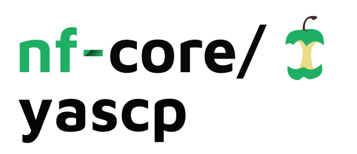
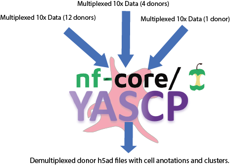

# 

[](https://github.com/nf-core/yascp/actions?query=workflow%3A%22nf-core+CI%22)
[](https://github.com/nf-core/yascp/actions?query=workflow%3A%22nf-core+linting%22)
[](https://nf-co.re/yascp/results)
[](https://doi.org/10.5281/zenodo.XXXXXXX)

[](https://www.nextflow.io/)
[](https://docs.conda.io/en/latest/)
[](https://www.docker.com/)
[](https://sylabs.io/docs/)

[](https://nfcore.slack.com/channels/yascp)
[](https://twitter.com/nf_core)
[](https://www.youtube.com/c/nf-core)

## Introduction
-  `Pipeline is currently under develpment.`
This is a merged pipeline wrapped in an nfCore template for transferability between institutes and HPC setups, based on our deconvolution (https://github.com/wtsi-hgi/nf_scrna_deconvolution.git ), cellbender (https://github.com/wtsi-hgi/nf_cellbender ) and qc (https://github.com/wtsi-hgi/nf_qc_cluster/tree/main ) pipelines. Input requires a tsv seperated file with paths to the 10x runs and if running in an genotype  additional input is required to be provided in an input.nf file pointing to the vcf location. This pipeline is designed to be used for multiple large scale single cell experiments ongoing in sanger. It is intended to add this pipeline to the nf-core framework in the future. 

<!-- TODO nf-core: Write a 1-2 sentence summary of what data the pipeline is for and what it does -->
**nf-core/yascp** is a bioinformatics best-practice analysis pipeline for deconvolution of a single cell datasets.

The pipeline is built using [Nextflow](https://www.nextflow.io), a workflow tool to run tasks across multiple compute infrastructures in a very portable manner. It uses Docker/Singularity containers making installation trivial and results highly reproducible. The [Nextflow DSL2](https://www.nextflow.io/docs/latest/dsl2.html) implementation of this pipeline uses one container per process which makes it much easier to maintain and update software dependencies. Where possible, these processes have been submitted to and installed from [nf-core/modules](https://github.com/nf-core/modules) in order to make them available to all nf-core pipelines, and to everyone within the Nextflow community!

<!-- TODO nf-core: Add full-sized test dataset and amend the paragraph below if applicable -->
On release, automated continuous integration tests run the pipeline on a full-sized dataset on the AWS cloud infrastructure. This ensures that the pipeline runs on AWS, has sensible resource allocation defaults set to run on real-world datasets, and permits the persistent storage of results to benchmark between pipeline releases and other analysis sources. The results obtained from the full-sized test can be viewed on the [nf-core website](https://nf-co.re/yascp/results).

<!--   -->
# 

## Pipeline summary

<!-- TODO nf-core: Fill in short bullet-pointed list of the default steps in the pipeline -->

1. Cellbender
2. CellSNP
3. Vireo
4. Souporcell
5. Celltypist
6. Azimuth
7. BBKNN
8. Harmony
9. Scrublet
10. Sccaf
11. Lisi
12. Isolation Forest


## Quick Start
Easyest to do is using a conda enviroment.

1. Install [`Nextflow`](https://www.nextflow.io/docs/latest/getstarted.html#installation) (`>=21.04.0`)
    ```console
    conda install nextflow=21.04.0
    ```

2. Install any of [`Docker`](https://docs.docker.com/engine/installation/), [`Singularity`](https://www.sylabs.io/guides/3.0/user-guide/), [`Podman`](https://podman.io/), [`Shifter`](https://nersc.gitlab.io/development/shifter/how-to-use/) or [`Charliecloud`](https://hpc.github.io/charliecloud/) for full pipeline reproducibility _(please only use [`Conda`](https://conda.io/miniconda.html) as a last resort; see [docs](https://nf-co.re/usage/configuration#basic-configuration-profiles))_
    ```console
    conda install singularity
    ```
3. Download/clone the pipeline and test it on a minimal dataset with a single command:

    NOTE - the test dataset is in preparation for the pipeline to be run - please contact HGI if want to test.
    ```console
    nextflow run nf-core/yascp -profile test,<docker/singularity/podman/shifter/charliecloud/conda/institute>
    ```

    > * Please check [nf-core/configs](https://github.com/nf-core/configs#documentation) to see if a custom config file to run nf-core pipelines already exists for your Institute. If so, you can simply use `-profile <institute>` in your command. This will enable either `docker` or `singularity` and set the appropriate execution settings for your local compute environment.
    > * If you are using `singularity` then the pipeline will auto-detect this and attempt to download the Singularity images directly as opposed to performing a conversion from Docker images. If you are persistently observing issues downloading Singularity images directly due to timeout or network issues then please use the `--singularity_pull_docker_container` parameter to pull and convert the Docker image instead. Alternatively, it is highly recommended to use the [`nf-core download`](https://nf-co.re/tools/#downloading-pipelines-for-offline-use) command to pre-download all of the required containers before running the pipeline and to set the [`NXF_SINGULARITY_CACHEDIR` or `singularity.cacheDir`](https://www.nextflow.io/docs/latest/singularity.html?#singularity-docker-hub) Nextflow options to be able to store and re-use the images from a central location for future pipeline runs.
    > * If you are using `conda`, it is highly recommended to use the [`NXF_CONDA_CACHEDIR` or `conda.cacheDir`](https://www.nextflow.io/docs/latest/conda.html) settings to store the environments in a central location for future pipeline runs.

4. Prepeare input.nf file with an associated input.tsv as in the sample_input folder and Start running your own analysis!

    <!-- TODO nf-core: Update the example "typical command" below used to run the pipeline -->

    ```console
    nextflow run /path/to/cloned/nfCore_scRNA -profile sanger -resume -c input.nf
    ```

input.nf sample is located in ./sample_input/input.nf

Which points to multiple files as input, but the main is a pointer to input file in input_data_table

```console
params{
    input = 'cellbender' //[cellranger|existing_cellbender]
    qc_cluster_input_files' //if cellbender is run already then can skip this by selecting existing_cellbender and input 
    cellbender_resolution_to_use='0pt1' //this is the default resolution, if not specifies [0pt01,0pt05] - these resolutions come from cellbender definition file - https://github.com/wtsi-hgi/yascp/blob/870165fe883658c19d339c26b08c729f45911f0a/conf/cellbender.config#L109
    extra_metadata = ''
    skip_preprocessing{
        value=false //this is only activated to skip all the filtering - ie cellbender and restart with qc analysis once the parametes are changed
        file__anndata_merged = ''
        file__cells_filtered = ''
    }
    
    run_celltype_assignment=true
    input_data_table = '../inputs.tsv'
    run_with_genotype_input=true
	genotype_input {
        subset_genotypes = false
        full_vcf_file = 'lifted.vcf.gz'
    }
}
```

1. input = default 'cellbender' which indicates cellbender will be run. Other options - [cellranger|existing_cellbender]
1. if running [existing_cellbender] - specify location to the results directory containing [cellbender_location='/full/path/to/results/nf-preprocessing/cellbender/qc_cluster_input_files']
2. full_vcf_file = points to vcf file to be used.
4. subset_genotypes = indicates to subset genotypes for an input to be used in Vireo.
5. run_celltype_assignment = runs celltypist and Azimuth if PBMC data is used.
6. file__anndata_merged = if all preprocession has already been doe can input a marged h5ad which will skio all the cellbender and deconvolution.
7. extra_metadata = any extra metadata to be added for samples.
8. input_data_table = is a file pointing to the 10x files as per:
Main file required is a paths to 10x files in a format:


| experiment_id   | n_pooled | donor_vcf_ids    |  data_path_10x_format   |
|-----------------|----------|------------------|-------------------------|
| 5892STDY8039553 |   1      | "id3"            | path/to/10x_folder      |
| 6123STDY11066014|   2      | "id1,id2"        | path/to/10x_folder      |


where:
experiment_id - is the name of the sample
n_pooled - indicates how many donors are pooled in the 10x run (if only 1 then scrubblet will be used to remove doublets)
donor_vcf_ids - if using genotyes, here an id of individuals can be added to subset vcfs used to deconvolute samples (need to be as listed in vcf file provided)
data_path_10x_format - path to a 10x folder containing bam, bai, metrics_summary.csv files and raw_barcodes folder


path/to/10x_folder should contain the folowing files:

```console
10x_folder/
    ./possorted_genome_bam.bai
    ./possorted_genome_bam.bam
    ./raw_feature_bc_matrix
        ./matrix.mtx.gz
        ./features.tsv.gz
        ./barcodes.tsv.gz
    .filtered_feature_bc_matrix
        ./matrix.mtx.gz
        ./features.tsv.gz
        ./barcodes.tsv.gz
    ./metrics_summary.csv
```


## Documentation

The nf-core/yascp pipeline comes with documentation about the pipeline [usage](https://nf-co.re/yascp/usage), [parameters](https://nf-co.re/yascp/parameters) and [output](https://nf-co.re/yascp/output).

## Credits

nf-core/yascp was originally written by HGI Sanger (Leland Taylor, Matiss Ozols, Guillaume Noell, Hannes Ponstingl, Vivek Iyer, Monika Krzak, Henry Taylor, Tobi Alegbe, Moritz Przybilla ).

We thank the following people for their extensive assistance in the development of this pipeline:

<!-- TODO nf-core: If applicable, make list of people who have also contributed -->

## Contributions and Support

If you would like to contribute to this pipeline, please see the [contributing guidelines](.github/CONTRIBUTING.md).

For further information or help, don't hesitate to get in touch on the [Slack `#yascp` channel](https://nfcore.slack.com/channels/yascp) (you can join with [this invite](https://nf-co.re/join/slack)).

## Citations

<!-- TODO nf-core: Add citation for pipeline after first release. Uncomment lines below and update Zenodo doi and badge at the top of this file. -->
<!-- If you use  nf-core/yascp for your analysis, please cite it using the following doi: [10.5281/zenodo.XXXXXX](https://doi.org/10.5281/zenodo.XXXXXX) -->

<!-- TODO nf-core: Add bibliography of tools and data used in your pipeline -->
An extensive list of references for the tools used by the pipeline can be found in the [`CITATIONS.md`](CITATIONS.md) file.

You can cite the `nf-core` publication as follows:

> **The nf-core framework for community-curated bioinformatics pipelines.**
>
> Philip Ewels, Alexander Peltzer, Sven Fillinger, Harshil Patel, Johannes Alneberg, Andreas Wilm, Maxime Ulysse Garcia, Paolo Di Tommaso & Sven Nahnsen.
>
> _Nat Biotechnol._ 2020 Feb 13. doi: [10.1038/s41587-020-0439-x](https://dx.doi.org/10.1038/s41587-020-0439-x).
