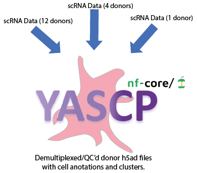

<p align="center">
  
</p>

## Introduction
<p align="center">
  
</p>

**nf-core/yascp** is a bioinformatics best-practice analysis pipeline designed for high-quality deconvolution, scRNA data quality control, doublet detection, cell type assignment, clustering, and integration of single-cell datasets. YASCP stands for "Yet Another Single Cell Pipeline." The sequence from Y to A in the acronym, referring to the alphabet, symbolizes the continuous journey of learning and discovery, with no Z to represent the ultimate knowledge that remains just out of reach, motivating us to keep exploring.

| experiment_id   | n_pooled | donor_vcf_ids    |  data_path_10x_format   |
|-----------------|----------|------------------|-------------------------|
| Pool1 |   1      | ""            | path/to/cellranger/10x_folder      |
| Pool2|   2      | ""        | path/to/cellranger/10x_folder      |

Results will demultiplex individuals, robustly assess the assignments


As well as assign celltypes, perform integrations, remove ambient RNA and produce publication ready plots


Developed under the leadership of N.Soranzo and Human Genetics Informatics (HGI), this large-scale single-cell pipeline was originally crafted for the Cardinal project (profiling UKBB and ELGH participants) but is versatile enough for broad scRNA analysis applications. 

Input requires a tsv seperated file [(please read detailed documentation here)](https://github.com/wtsi-hgi/yascp/tree/yascp_docs) with paths and if running in an genotype  additional input is required to be provided in an input.nf file pointing to the vcf location. This pipeline is designed to be used any large scale single cell experiments.

The foundational ideas were inspired by earlier pipelines from Anderson lab but has been expanded, specifically those for [deconvolution](https://github.com/wtsi-hgi/nf_scrna_deconvolution.git), [cellbender](https://github.com/wtsi-hgi/nf_cellbender), and [quality control and clustering](https://github.com/wtsi-hgi/nf_qc_cluster/tree/main). This ensures a robust integration of proven methodologies tailored to meet the demands of expansive single-cell data analysis.

<p align="center">
  
</p>
<!-- TODO nf-core: Add full-sized test dataset and amend the paragraph below if applicable -->
<!-- On release, automated continuous integration tests run the pipeline on a full-sized dataset on the AWS cloud infrastructure. This ensures that the pipeline runs on AWS, has sensible resource allocation defaults set to run on real-world datasets, and permits the persistent storage of results to benchmark between pipeline releases and other analysis sources. The results obtained from the full-sized test can be viewed on the [nf-core website](https://nf-co.re/yascp/results). -->

## Quick Start

1. Install [`Nextflow`](https://www.nextflow.io/docs/latest/getstarted.html#installation) (`>=21.04.0`)
2. Install any of [`Docker`](https://docs.docker.com/engine/installation/), [`Singularity`](https://www.sylabs.io/guides/3.0/user-guide/)for full pipeline reproducibility.
3. Download/clone the pipeline and test it on a minimal dataset with a single command:

    ```console
    git clone https://github.com/wtsi-hgi/yascp.git
    nextflow run /path/to/colned/yascp -profile test,<docker/singularity,institute>
    ```

## Run on your own data

1. Prepeare input.tsv file:
   
| experiment_id   | n_pooled | donor_vcf_ids    |  data_path_10x_format   |
|-----------------|----------|------------------|-------------------------|
| Pool1 |   1      | ""            | path/to/cellranger/10x_folder      |
| Pool2|   2      | ""        | path/to/cellranger/10x_folder      |

2. Run on your data
    ```console
    git clone https://github.com/wtsi-hgi/yascp.git
    nextflow run /path/to/colned/yascp -profile test,<docker/singularity,institute> --input_data_table input.tsv
    ```
    
## Pipeline summary
Pipeline has a modular design ensuring that the bits and piecies can be run independently according to project needs. Overall pipeline is focussed arounf main steps:
1. Cellbender
2. CellSNP
3. Vireo
4. Souporcell
5. Celltypist
6. Azimuth
7. BBKNN
8. Harmony
9. Scrublet, DoubletDecon, DoubletFinder, SCDS, scDblFinder, DoubletDetection
10. Sccaf
11. Lisi
12. Isolation Forest
13. Hard filters
14. Genotype deconvolution and GT match against multiple panels.
15. Citeseq DSB normalisations, 
16. Cell genotype concordance Calculations


You can run pipeline blocks independently:


## Documentation: Prepearing your own data and interpreting the results

To understand how to prepeare your own data and how to interpret the results please refear to [documents HERE](https://github.com/wtsi-hgi/yascp/tree/yascp_docs)


## Credits

Yascp was originally written by Matiss Ozols; Leland Taylor, Guillaume Noell, Hannes Ponstingl, Vivek Iyer,  Henry Taylor, Tobi Alegbe, Monika Krzak, Alessandro Raveane, Carl Anderson, Anna Lorenc, Haerin Jang, Niek de Klein, Stephen Watt, Nicole Soranzo, Oliver Stegle.
<!-- TODO nf-core: If applicable, make list of people who have also contributed -->

The pipeline is built using [Nextflow](https://www.nextflow.io), a workflow tool to run tasks across multiple compute infrastructures in a very portable manner. It uses Docker/Singularity containers making installation trivial and results highly reproducible. The [Nextflow DSL2](https://www.nextflow.io/docs/latest/dsl2.html) implementation of this pipeline uses one container per process which makes it much easier to maintain and update software dependencies. Where possible, these processes have been submitted to and installed from [nf-core/modules](https://github.com/nf-core/modules) in order to make them available to all nf-core pipelines, and to everyone within the Nextflow community!

## Contributions and Support

We wellcome all contributions. If you would like to contribute to this pipeline, please create a fork and then create a pull request, and inform Matiss (mo11@sanger.ac.uk) re the changes made and additions added.

## Citations

Currently pipeline has not been published but we would really appreciate if you could please acknowlage the use of this pipeline in your work:

> Ozols, M. et al. 2023. YASCP (Yet Another Single Cell Pipeline): GitHub. https://github.com/wtsi-hgi/yascp. 

<!-- TODO nf-core: Add citation for pipeline after first release. Uncomment lines below and update Zenodo doi and badge at the top of this file. -->
<!-- If you use  nf-core/yascp for your analysis, please cite it using the following doi: [10.5281/zenodo.XXXXXX](https://doi.org/10.5281/zenodo.XXXXXX) -->
<!-- TODO nf-core: Add bibliography of tools and data used in your pipeline -->

An extensive list of references for the tools used by the pipeline can be found in the [`CITATIONS.md`](CITATIONS.md) file.

We have used nf-cores template to develop this pipeline. You can cite the `nf-core` publication as follows:

> **The nf-core framework for community-curated bioinformatics pipelines.**
> Philip Ewels, Alexander Peltzer, Sven Fillinger, Harshil Patel, Johannes Alneberg, Andreas Wilm, Maxime Ulysse Garcia, Paolo Di Tommaso & Sven Nahnsen.
> _Nat Biotechnol._ 2020 Feb 13. doi: [10.1038/s41587-020-0439-x](https://dx.doi.org/10.1038/s41587-020-0439-x).
