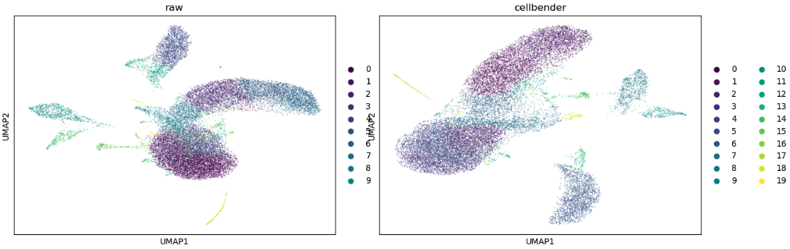
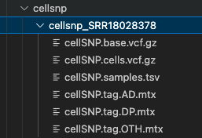
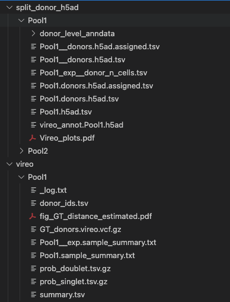
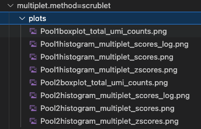
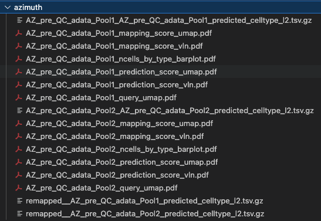
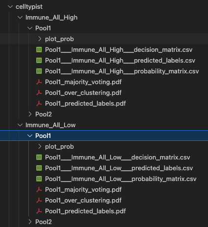
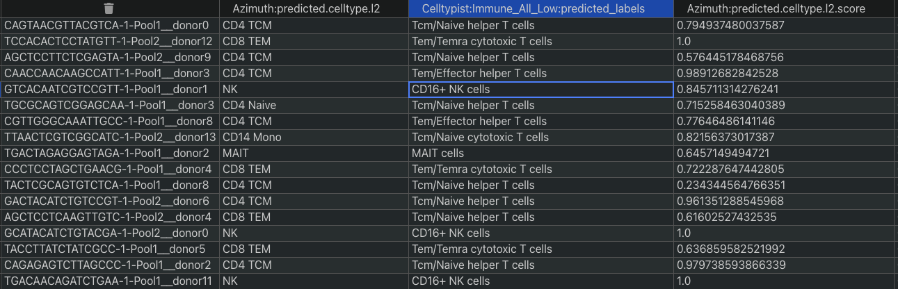

# nf-core/yascp: Output

## Introduction

This document describes the output produced by the pipeline.

<!-- TODO nf-core: Write this documentation describing your workflow's output -->

# Pipeline overview

The pipeline is built using [Nextflow](https://www.nextflow.io/) and processes data using the following steps:

## Alignment step
* [Cellranger](#Cellranger) - Curently users have to run Cellranger (6.11) upstream of pipeline, but an option to run it will be added shortly
#### Ambient RNA removal
* [Ambient RNA Removal using Cellbender](#Cellbender) - Reads the Cellranger outputs and removes the ambient RNA using [Cellbender](https://github.com/broadinstitute/CellBender)

Output file structure ( nf-preprocessing/cellbender ):

*   Here we have multiple different plots and output files, however the most important ones are the matrix and h5ad files after the ambient rna removal: such as cellbenderFPR_0pt1filtered_10x_mtx/ cellbender_FPR_0.1_filtered.h5
    * 

Cellbender output plots:

*   Cellbender output plots:
    * 

## Genotype processing and Donor deconvolutions (if more than 1 donor is in the pool) and Multiplet/Unassigned cell removal
* [Genotype processing](#Genotype_processing) - If users provide the genotypes this step slices and dices the genotypes to prepeare these for the CellSNP/Vireo deconvolutions and GT matches
* [Donor Deconvolution using CellSnp/Vireo](#CellSnp/Vireo) - We run cellsnp and vireo to deconvolute donors if the input file has indicated that there are more than 1 donors in the pool.

Cellsnp Output files:

* Cellsnp profiles each of the droplets for the variants in them, which is later utilised by vireo to assign the particular cell to the donor cluster:
    * 

Vireo Output files:

* Vireo takes the cellsnp variant pileups and assigns donors the particular cell to the donor cluster:
    * 

Scrublet Output files:

* By default we always run Scrublet - if we have no donors pooled in the run (i.e if we have only 1 donor), then the doublets will be removed by scrublet instead of vireo:

    * 

* [Donor Deconvolution using Souporcell](#Souporcell) - Souporcell option both removes the ambioent RNA and deconvolutes the donors [currently however this option is broken and will be fixed soon]
* [GT match](#GT_match) - This step utilises the prepeared genotypes and the infered genotypes by Vireo and picks out the donor that corresponds to the right reads.
## Celltype identification
#### [Azimuth](#Azimuth) - Uses Azimuth PBMC l2 reference (pipeline will be adjusted later to be more general for other tissue types) to assign the celltypes. Downstream it maps the l2 to l1 and l3 as per https://github.com/wtsi-hgi/yascp/blob/main/assets/azimuth/Azimuth_Mappings.txt 

Azimuth Output files:

* By default we run azimuth l2 celltype assignment:

    * 

#### [Celltypist](#Celltypist) - Performs cellype assignment using celltypist Imule Low and Imune High profiles (this will be adjusted to use more references)

Celltypist Output files:

* By default we run Imune High, Imune Low and Imune PBMC reference celltype assignment:

    * 

Combined celltypes file:

* A combined Celltypes file is produced by pipeline where all different references are combined in one spreadsheet.:

    * 

#### [Keras celltype transfer](#Keras) - This is utilising pretrained reference panels for celltype assignment - curently only works in Sanger.
## Donor and Cell QC
* [Isolation Forest](#Isolation_Forest) - 
* [Hard filters](#Hard_filters) -
## Batch corrections and clustering
* [BBKNN](#BBKNN) - 
* [Harmony](#BBKNN) - 
## Cluster assesments
* [Lisi](#Lisi) - 
* [Sccaf](#Sccaf) - 

   

### Cellsnp

[Cellsnp](https://github.com/single-cell-genetics/cellSNP).

[Nextflow](https://www.nextflow.io/docs/latest/tracing.html) provides excellent functionality for generating various reports relevant to the running and execution of the pipeline. This will allow you to troubleshoot errors with the running of the pipeline, and also provide you with other information such as launch commands, run times and resource usage.