# nf-core/yascp: Output

## Introduction

This document describes the output produced by the pipeline.

<!-- TODO nf-core: Write this documentation describing your workflow's output -->

# Pipeline overview

The pipeline is built using [Nextflow](https://www.nextflow.io/) and processes data using the following steps:
The overall results folder will look simmillar to this:

Where we have outputs from different steps of pipeline:
* [cellsnp](#cellsnp)
* [celltype identification](#celltype-identification)
* citeseq data processing
* [clustering and integration](#integration-and-clustering)
* [sample deconvolution](#vireo)
* [doublet detection](#doublet-detection)
* [genotype match](#vireo) to determine sample matches
* [handover](#handover) folder where summary statistics, plots and final qcd and annotated h5ads per donor are stored at.
* infered genotypes - output from vireo that has generated vcf files for each of the deconvoluted donors in pool.
* merged_h5ads - different preprocessing step merged h5ads (these allow to start the pipeline again in a clustering only mode)
* [nf-preprocessing](#ambient-rna-removal) - contains cellbender results
* pipeline info - statistics of the pipeline run.
* plots - some quality control plots.
* recourses - reference genome used in data processing.
* UMAPS - summary plot UMAPS - for a quick look. 

Each of these steps and the outputs produced are decribed more in detail bellow:

## Alignment step
#### [Cellranger](#Cellranger) - Curently users have to run Cellranger upstream of pipeline - we suggest to use the [no-cores pipeline](https://nf-co.re/scrnaseq/2.5.1) - https://nf-co.re/scrnaseq/2.5.1
## Ambient RNA removal
#### [Ambient RNA Removal using Cellbender](#Cellbender) - Reads the Cellranger outputs and removes the ambient RNA using [Cellbender](https://github.com/broadinstitute/CellBender)

Output file structure ( nf-preprocessing/cellbender ):

*   Here we have multiple different plots and output files, however the most important ones are the matrix and h5ad files after the ambient rna removal: such as cellbenderFPR_0pt1filtered_10x_mtx/ cellbender_FPR_0.1_filtered.h5
    * 

Cellbender output plots:

*   Cellbender output plots:
    * 

## Genotype processing and Donor deconvolutions (if more than 1 donor is in the pool) and Multiplet/Unassigned cell removal
####  [Genotype processing](#Genotype_processing) - If users provide the genotypes this step slices and dices the genotypes to prepeare these for the CellSNP/Vireo deconvolutions and GT matches
#### [Donor Deconvolution using CellSnp/Vireo](#CellSnp/Vireo) - We run cellsnp and vireo to deconvolute donors if the input file has indicated that there are more than 1 donors in the pool.

#### Cellsnp

Cellsnp Output files:

* Cellsnp profiles each of the droplets for the variants in them, which is later utilised by vireo to assign the particular cell to the donor cluster:
    * 

Vireo Output files:

#### Vireo
* Vireo takes the cellsnp variant pileups and assigns donors the particular cell to the donor cluster:
    * 

#### Doublet Detection

Scrublet Output files:

* By default we always run Scrublet - if we have no donors pooled in the run (i.e if we have only 1 donor), then the doublets will be removed by scrublet instead of vireo:
    * 

DoubletDecon Output files:

    
* DoubletDecon output files contain barcode and label of whether its a singlet or a doublet:
    * 

doubletdetection Output files:

    
* doubletdetection output files contain barcode and label of whether its a singlet or a doublet:
    * 

DoubletFinder Output files:

    
* DoubletFinder output files contain barcode and label of whether its a singlet or a doublet:
    * 

scDblFinder Output files:

    
* scDblFinder output files contain barcode and label of whether its a singlet or a doublet:
    * 

SCDS Output files:

    
* SCDS output files contain barcode and label of whether its a singlet or a doublet:
    * 

#### [Donor Deconvolution using Souporcell](#Souporcell) - Souporcell option both removes the ambioent RNA and deconvolutes the donors [currently however this option is broken and will be fixed soon]

#### [GT match](#GT_match) - This step utilises the prepeared genotypes and the infered genotypes by Vireo and picks out the donor that corresponds to the right reads. 

GT input files:

* Users can provide multipple different cohort VCFs and that are split per chromosomes or one big vcf/bcf file.:
    * 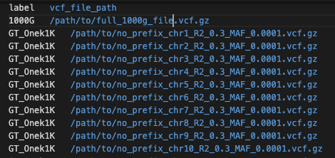

GT match results structure:

* GT match produces multiple metrics that assesses whether donor is the one we expect and what is the relatedness within pool.
    * 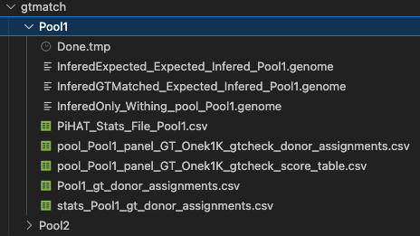

* Results indicate which donor from Vireo deconvolutions is which:
    * 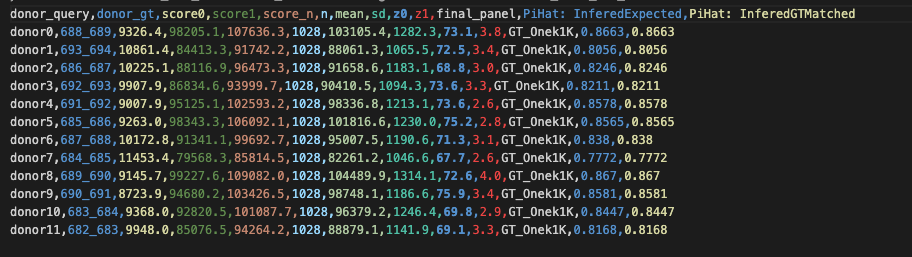

## Celltype identification
#### [Azimuth](#Azimuth) - Uses Azimuth PBMC l2 reference (pipeline will be adjusted later to be more general for other tissue types) to assign the celltypes. Downstream it maps the l2 to l1 and l3 as per https://github.com/wtsi-hgi/yascp/blob/main/assets/azimuth/Azimuth_Mappings.txt 

Azimuth Output files:

* By default we run azimuth l2 celltype assignment:

    * 

#### [Celltypist](#Celltypist) - Performs cellype assignment using celltypist Imule Low and Imune High profiles (this will be adjusted to use more references)

Celltypist Output files:

* By default we run Imune High, Imune Low and Imune PBMC reference celltype assignment:

    * 

Combined celltypes file:

#### [Keras celltype transfer](#Keras) - This is utilising pretrained reference panels for celltype assignment - curently only works in Sanger.

#### Combined File - A combined Celltypes file is produced by pipeline where all different references are combined in one spreadsheet.:

    * 

## Donor and Cell QC
### We perform different types of QC, Adaptive Isolation Forests, Adaptive Isolation Forests per celltype, Hard Filters tresholds.

Data QC output folder structure:

*   QC output Folder structure:
    * 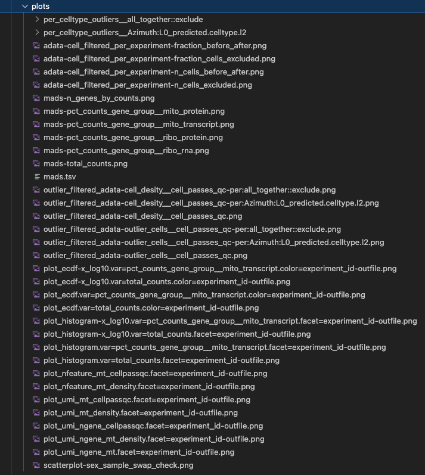

####  [Isolation Forest](#Isolation_Forest)

We parfor Isolation forests in different resolutions - All data together, Per Celltype adaptive qc:

*   All together Isolation Forests:
    * 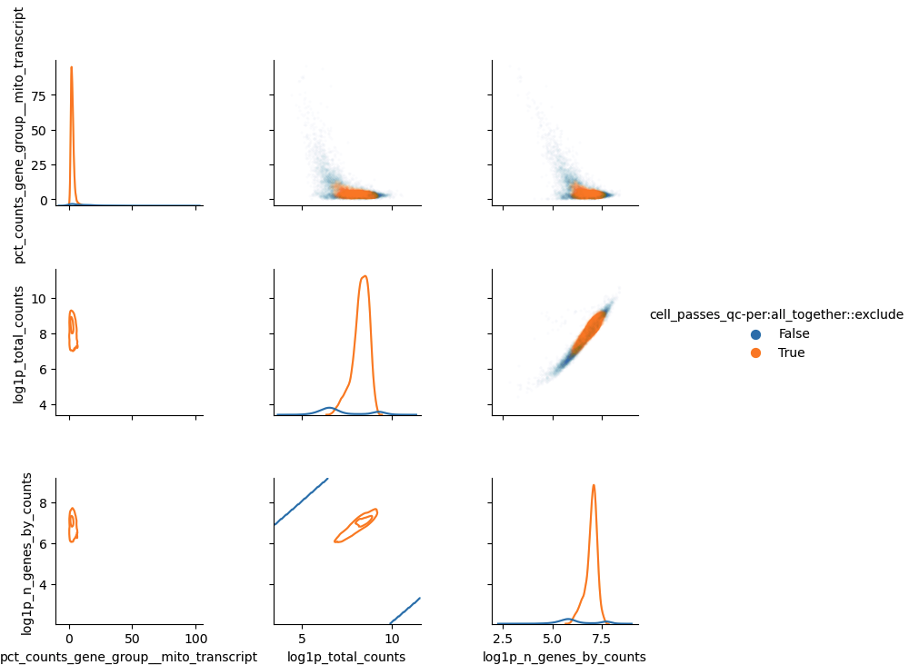
*   Per Celltype Isolation Forests:
    * 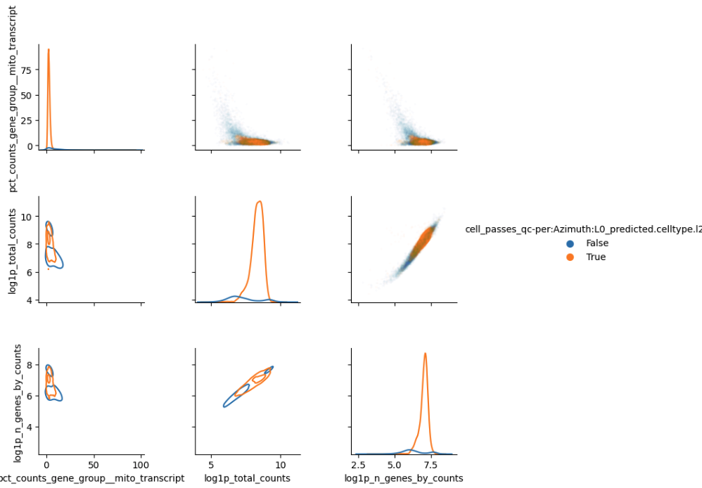

####  [Hard filters](#Hard_filters): We also perform hard filters if user has specified that this is something thats required.

## Integration and clustering
### By default multiple different clustering resolutions will be run for both BBKNN and Harmony resulting in a subfolder structure. Pipeline automatically estimates the best number of PCs to use for clustering using knee and elbow plots that can be found in plots section.

Output file structure ( clustering ):

*   Clustering combines all different integration methodologies utilised and in addition different plots in a structure represented in this layout:
    * 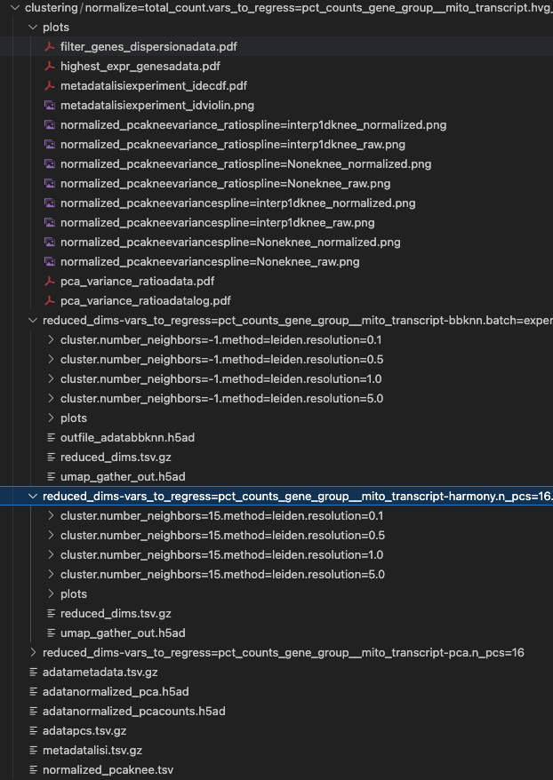

#### [BBKNN](#BBKNN) - 

BBKNN file structure ( clustering ):

*   BBKNN is performed with different clustering resolutions and each of the clusters assesed ussing sccaf:
    * 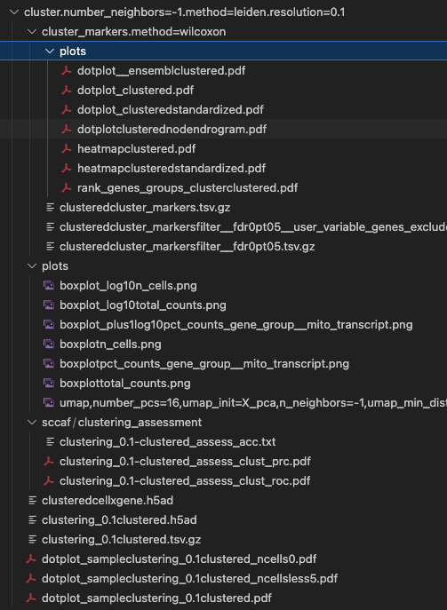

BBKNN sample UMAPS Coloured:

*   Resolution 0.1: BBKNN is performed with different clustering resolutions and each of the clusters assesed ussing sccaf:
    * 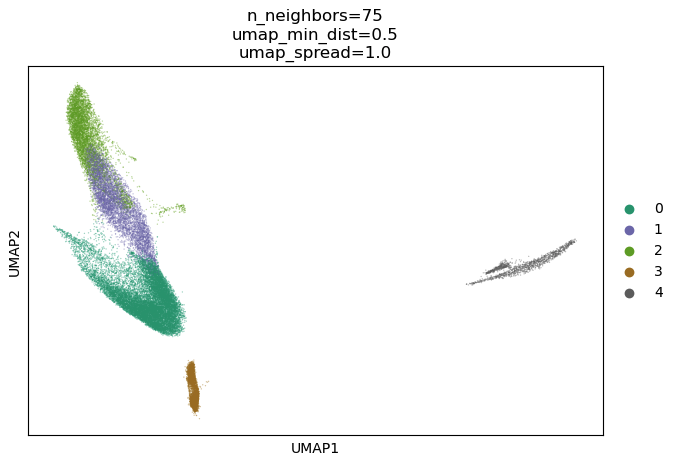
*   Resolution 5: BBKNN is performed with different clustering resolutions and each of the clusters assesed ussing sccaf:
    * 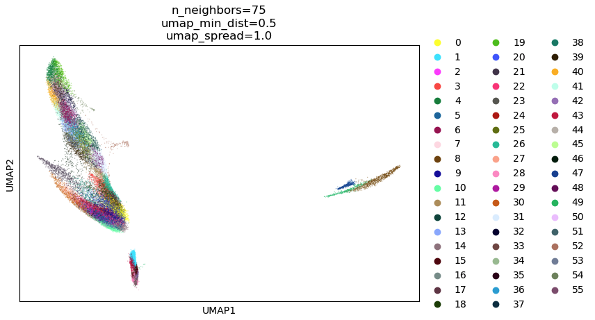
*   Mitochondial transcripts: Coloured UMAP: We also color each of the bespoke clusters with different metrics:
    * 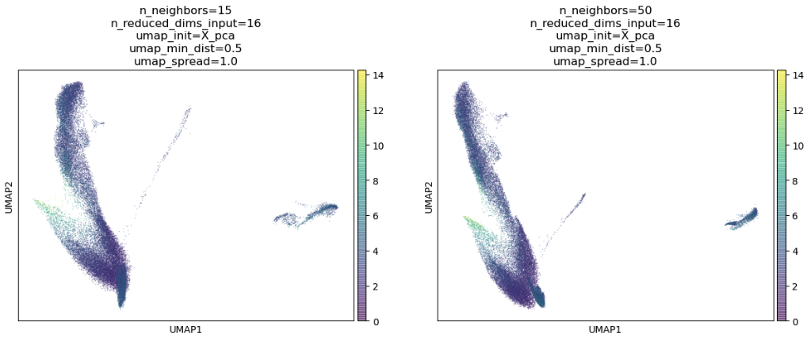

#### [Harmony](#Harmony) - 

Harmony file structure ( clustering ):

*   Harmony is performed with different clustering resolutions and each of the clusters assesed ussing sccaf:
    * 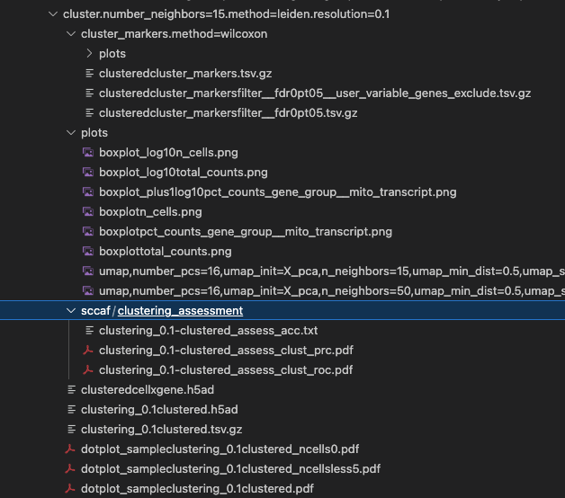

Harmony sample UMAPS Coloured:

*   Resolution 0.1: Harmony is performed with different clustering resolutions and each of the clusters assesed ussing sccaf:
    * 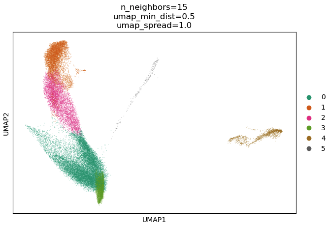
*   Resolution 5: Harmony is performed with different clustering resolutions and each of the clusters assesed ussing sccaf:
    * 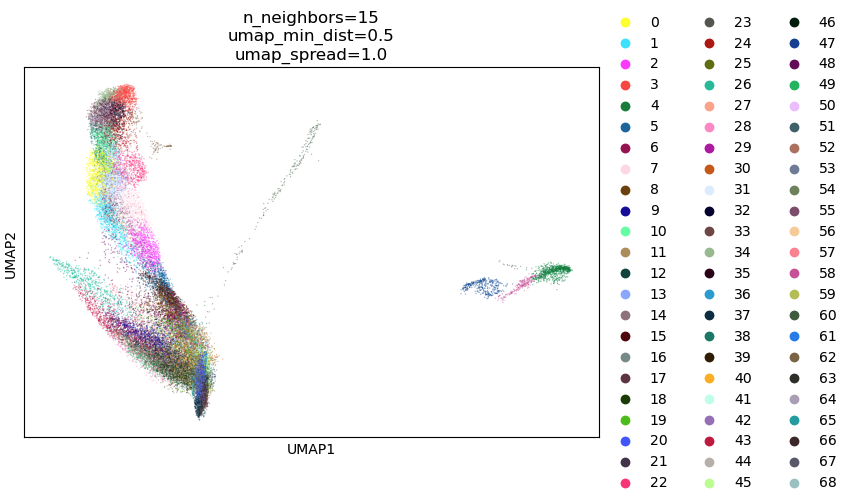
*   Mitochondial transcripts: Coloured UMAP: We also color each of the bespoke clusters with different metrics:
    * 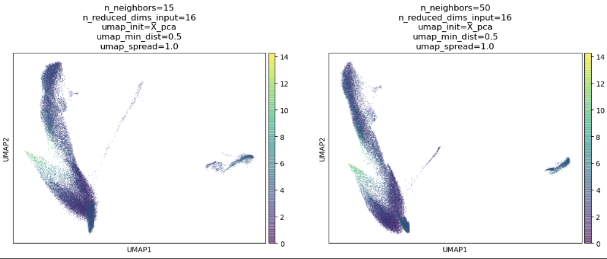

Harmony cluster evaluations and cluster markers:

*   Histograms: Multiple useful prolts are produced to look at the clusterings:
    * 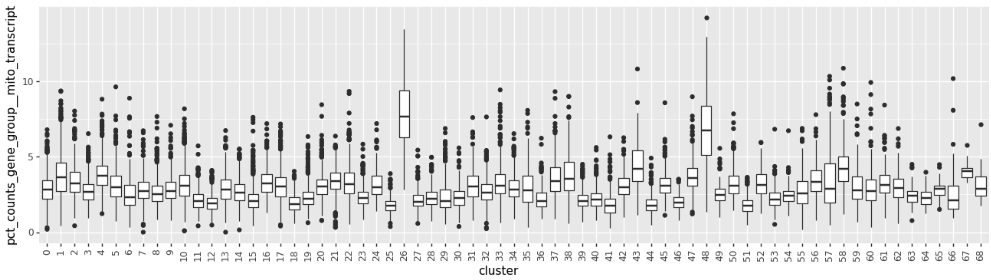
*   Dotplots: Multiple useful prolts are produced to look at the clusterings:
    * 

#### [PCA](#BBKNN) 

PCA file structure ( clustering ):

*   PCA is performed on the integrated data:
    * 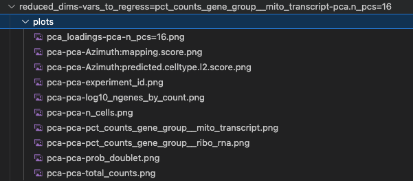

PCA file structure ( clustering ):

*   Gene Loadings for each of the PCA is evaluated:
    * 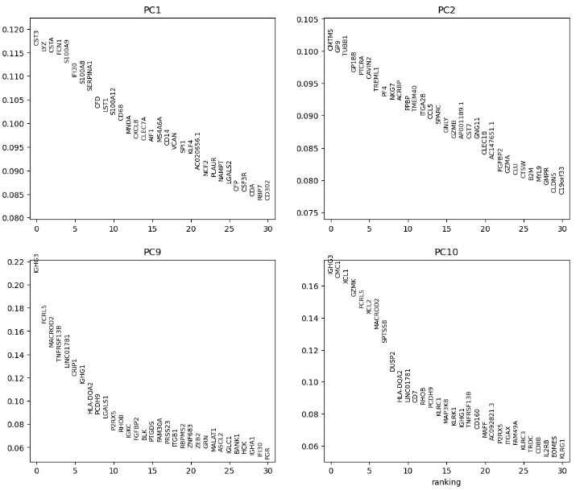

## Cluster assesments
#### [Sccaf](#Sccaf) We perform Sccaf to asses the clustering accuracies, these are useful metrics in picking the best resolution for clustrering.

Sccaf file structure ( clustering ):

*   As described above clustering is assesed using scaff: directory structure:
    * 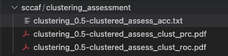

*   Precission recall curves:
    * 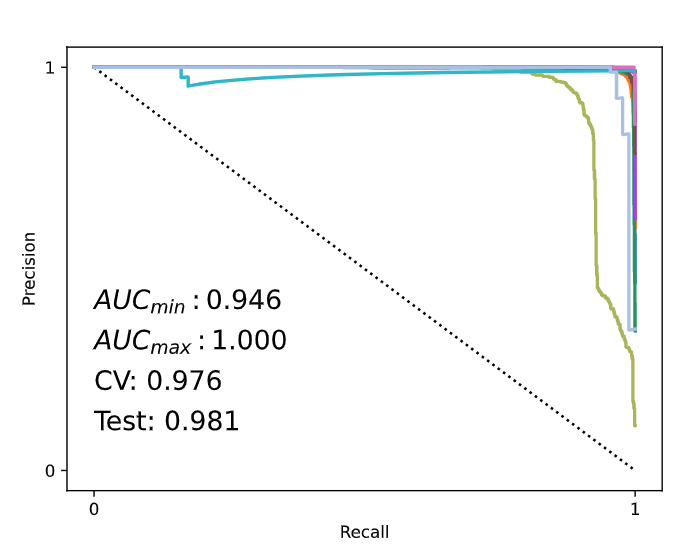

*   ROC:
    * 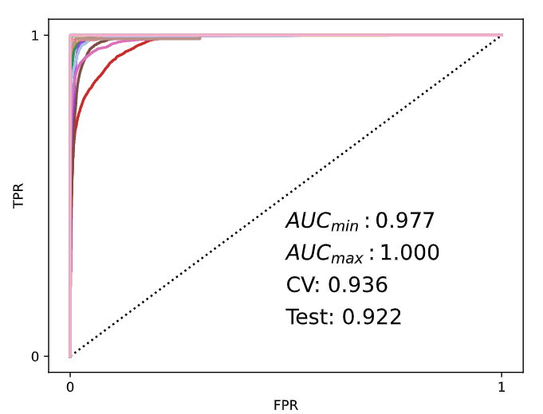

*   Accuracy:
    * 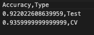

#### [Lisi](#Lisi) We also have a capability in running LISI cluster assesments, however curently this option does not run by default as it is memory demanding and requires some further optimisations

## [Handover](#handover): Summary Statistics, Per Donor h5ad files, Summary Plots
    * 
In this folder we can see 3 different folders:
* Donor_Quantification - where we can see the Cellranger filtered, Cellranger raw, Cellbender filtered files that are used to produce the filal per donor h5ad files and the metadata features in the per donor tsv files
    * 

* Donor_Quantification_summary folder where we have summary statistics per donor and summary statistics per tranche (collection of all pools that were run in this run).
    * 

* Summary _plots contains the most important plots per each of the steps for a quick inversigations of the performance of the scRNA runs and the performance of the analysis.
    * 

[Nextflow](https://www.nextflow.io/docs/latest/tracing.html) provides excellent functionality for generating various reports relevant to the running and execution of the pipeline. This will allow you to troubleshoot errors with the running of the pipeline, and also provide you with other information such as launch commands, run times and resource usage.

